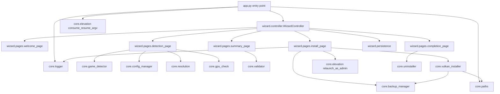

<!-- generated-by: gsd-doc-writer -->
# Architecture

## System overview

Echoes Vulkan Helper is a single-process Windows desktop application written in Python (>=3.10) using `customtkinter` for the UI. It guides a user through a 5-step wizard that detects an existing LOTRO: Echoes of Angmar install, locates the user config file, optionally elevates to administrator, and copies a bundled DXVK-based Vulkan compatibility shim (`d3d9.dll`, `dinput8.dll`, `dinput8.ini`) into the game directory with a rotating backup. The application is shipped as a single-file PyInstaller executable and also runs from source via `python app.py`. Architecture style: layered — a headless `core/` domain layer that contains all side-effecting logic (filesystem, registry, logging, UAC), and a thin `wizard/` presentation layer that drives the `core` API through a stack of `customtkinter` frames owned by a single `WizardController`.

## Component diagram



## Data flow

1. `app.py:main()` calls `core.logger.setup_logging(logs_dir())` and then `core.paths.assert_vulkan_assets_present()`; on missing assets it shows a `tkinter.messagebox` error and exits with code 2.
2. `app.py` hydrates a `WizardState` from a resume file (if the user accepted a UAC elevation in a previous run) and instantiates `WizardController(initial_state)`.
3. The controller builds a brand bar, a content frame, and a navigation bar. It pre-instantiates all five page frames and stacks them in `_content`; navigation is `tkraise()`-based.
4. The controller calls `wizard.persistence.load_state()` to restore last-known config and game paths into `WizardState`, so the user does not re-browse on every run.
5. **Welcome → Detection**: `DetectionPage` runs `core.game_detector.find_game_dir()` (Windows registry + heuristic folder scan) and `core.game_detector.is_writable()`. It also opens `UserPreferences.echoes.ini` via `core.config_manager` and stores its path. Display/GPU checks use `core.resolution` and `core.gpu_check`. Failures are recorded in `WizardState.detection_errors`.
6. **Summary**: `core.validator` runs all collected inputs through a set of checks. The user reviews the plan; the controller swaps the right-hand button label to "Install  >".
7. **Install**: `InstallPage` starts a worker thread that:
   - calls `core.elevation.relaunch_as_admin(state)` if the game directory is not writable, persisting state to `core.paths.temp_state_path()` so the elevated process resumes on the install page;
   - calls `core.vulkan_installer.install_vulkan(game_dir, source_dir)`, which in turn calls `core.backup_manager.create_backup()` to rotate any pre-existing `<file>.backup[.N]` chains;
   - streams `core.logger` records through a `QueueHandler` shared with the UI for a live log panel.
8. On error, `VulkanInstallError.result` carries the partial mutation record; the install page can invoke `core.vulkan_installer.rollback(result)` and the completion page exposes single-click recovery via `core.uninstaller`.

## Key abstractions

| Abstraction | Location | Purpose |
|---|---|---|
| `WizardController` | `wizard/controller.py` | Subclass of `ctk.CTk`; owns the page stack, brand bar, nav bar, design tokens, and `WizardState`. Switches pages via `tkraise()` and exposes `go_next()` / `go_to(name)`. |
| `WizardState` | `wizard/controller.py` | Dataclass holding every field the wizard passes between pages (paths, detection errors, validation result, install result, abort/elevation flags). |
| `Page` frames | `wizard/pages/*.py` | `WelcomePage`, `DetectionPage`, `SummaryPage`, `InstallPage`, `CompletionPage`. Each implements `on_enter(state)`, optional `can_advance()`, optional `on_exit()`, and (for install) `request_abort()`. |
| `install_vulkan(game_dir, source_dir)` | `core/vulkan_installer.py` | Copies the three Vulkan files into the game directory, rotating pre-existing files into a `.backup[.N]` chain. Returns a `VulkanInstallResult`; raises `VulkanInstallError` carrying the partial result on failure. |
| `create_backup(path)` | `core/backup_manager.py` | Performs a single-step rotation of a target file to `<name>.backup` (or next free `.backup.N` slot). |
| `relaunch_as_admin(state)` / `load_resume_state(path)` | `core/elevation.py` | Persists `WizardState` to JSON, asks UAC to relaunch the EXE with `--resume <path>`, and re-hydrates state in the new process. |
| `find_game_dir()` | `core/game_detector.py` | Auto-detects the LOTRO install: reads `HKLM\SOFTWARE\StandingStoneGames\LOTRO\InstallLocation` (and WOW6432Node), probes `SteamPath`, then falls back to a small set of common install roots. |
| `resource_path(relative)` / `bundle_root()` | `core/paths.py` | Resolves a bundled asset path transparently in both dev (`python app.py`) and PyInstaller `--onefile` runs (`sys._MEIPASS`). |
| `assert_vulkan_assets_present()` | `core/paths.py` | Returns the list of missing `dinput8.ini`, `dinput8.dll`, `d3d9.dll` from `assets/vulkan/`; used by the entry point to fail fast. |
| `setup_logging(log_dir)` | `core/logger.py` | Attaches a `RotatingFileHandler` (1 MB × 3) and a `_UiQueueHandler` that lets the install page render log records live. |
| `wizard.persistence` | `wizard/persistence.py` | Save/load the last-known config + game paths so they survive across runs. |

## Directory structure rationale

```
.
├── app.py                  # Process entry point: logging, asset check, controller bootstrap.
├── core/                   # Headless domain layer. No UI imports. All side effects live here.
│   ├── __init__.py         # Exposes __app_name__, __version__, __version_info__.
│   ├── paths.py            # Frozen vs dev path resolution, asset assertion, per-user data dirs.
│   ├── logger.py           # Rotating file + UI queue handlers.
│   ├── game_detector.py    # Windows registry + filesystem search for the game install.
│   ├── config_manager.py   # Read/write UserPreferences.echoes.ini.
│   ├── resolution.py       # Enumerate displays via `screeninfo`.
│   ├── gpu_check.py        # Best-effort Vulkan adapter presence check.
│   ├── validator.py        # Pre-install validation rules on WizardState.
│   ├── backup_manager.py   # Single-step rotating backup of pre-existing game files.
│   ├── vulkan_installer.py # Copy + rotate + rollback for the three Vulkan files.
│   ├── uninstaller.py      # Restore from the most recent `.backup[.N]`.
│   └── elevation.py        # UAC relaunch with state handoff.
├── wizard/                 # Presentation layer (customtkinter). Talks to core/, never touches the FS directly.
│   ├── controller.py       # CTk app, design tokens, page stack, nav bar.
│   ├── anim.py             # Tiny tween helper for page transitions.
│   ├── persistence.py      # Save/load last-known paths.
│   └── pages/              # One file per wizard step; each is a CTkFrame.
├── assets/vulkan/          # The three files copied into the game dir. Drop DXVK builds here.
├── tools/                  # One-off dev scripts (not shipped).
├── tests/                  # pytest suite (testpaths in pyproject.toml).
├── logs/                   # Created at runtime; install.log + rotated copies.
├── build/                  # PyInstaller scratch.
├── dist/                   # PyInstaller output (EchoesVulkanHelper.exe).
├── app.spec                # PyInstaller spec (if present).
├── pyproject.toml          # Setuptools build, ruff lint/format, pytest config.
├── requirements.in         # Top-level deps (customtkinter, screeninfo, pywin32).
└── requirements.lock.txt   # Pinned transitive deps for reproducible builds.
```

- `core/` is intentionally import-safe from any context (it does not import `wizard/` or `tkinter` at module scope). This keeps the domain logic testable and lets the build strip the wizard if a future CLI is added.
- `wizard/` is allowed to import `core/`, but `core/` is forbidden from importing `wizard/`. The controller is the only place that wires the two layers together.
- The five page files are split one-per-step (rather than a single large `pages.py`) so each step can be reviewed, themed, and unit-tested in isolation; shared visuals live in `wizard/pages/_common.py`.
- `assets/vulkan/` is a leaf that ships inside the PyInstaller bundle via `--add-data` and is the only directory the installer mutates on the user's machine (the game directory, with a backup chain).
- `tests/` mirrors the package layout and is excluded from the built wheel by `[tool.setuptools.packages.find]` in `pyproject.toml`.
